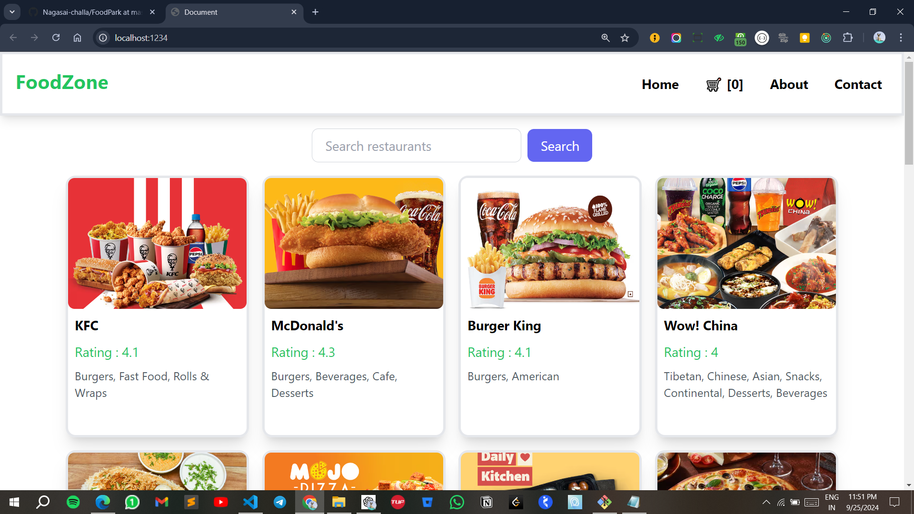
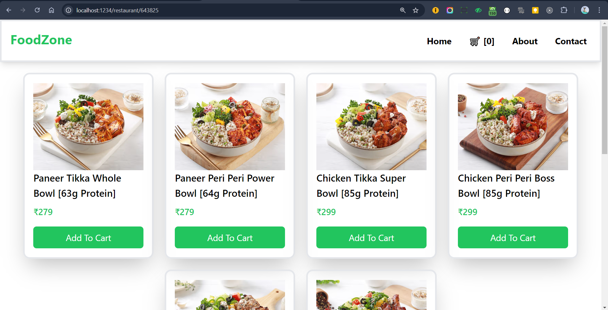
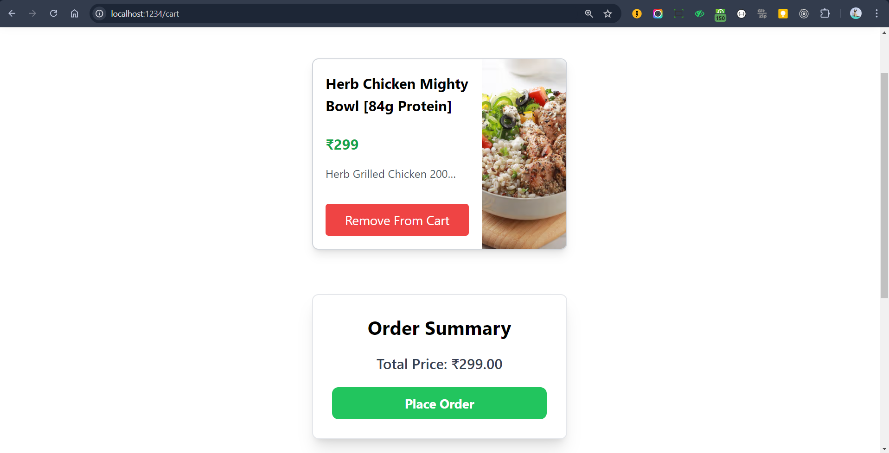
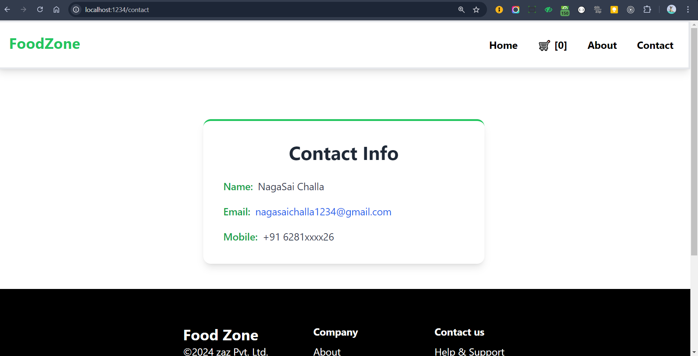

[Visit FoodPark Project](https://66f45a364f765000f63ffb7b--warm-longma-f76610.netlify.app/)
# Food Delivery App

## Overview

The **Food Delivery App** is a dynamic and interactive web application built using **React** and **Redux** for state management. It leverages the **Swiggy API** to provide real-time restaurant data, allowing users to explore various restaurant menus, add items to their cart, and place orders seamlessly. The application showcases my skills in modern web development technologies, providing an engaging user experience through responsive design.

---

## Table of Contents

1. [Motivation](#motivation)
2. [Features](#features)
3. [Technologies Used](#technologies-used)
4. [Setup and Installation](#setup-and-installation)
5. [Usage](#usage)
6. [Customization](#customization)
7. [Code Structure](#code-structure)
8. [Learning Objectives](#learning-objectives)
9. [Challenges Faced](#challenges-faced)
10. [Future Enhancements](#future-enhancements)
11. [License](#license)

---

## Motivation

The motivation behind this project was to create a user-friendly platform that simplifies the process of food ordering online. The project allows users to explore menus from various restaurants, providing a one-stop solution for food delivery. By utilizing the Swiggy API, I aimed to deliver real-time data to users while showcasing my proficiency in React and Redux.

---

## Features

- **Real-Time Restaurant Data**: Fetch and display live data from the Swiggy API, showcasing various restaurant menus and items.
- **Dynamic Cart Management**: Users can add multiple items to their cart, adjust quantities, and remove items as needed.
- **Responsive Design**: Built with mobile-first principles using Tailwind CSS for an optimal user experience across devices.
- **User-Friendly UI**: Clean and intuitive user interface that guides users through the food ordering process.
- **Order Placement**: A simple flow for users to place their orders with ease.

---

## Technologies Used

- **HTML**: For structuring the web application.
- **CSS**: For styling the application (with Tailwind CSS for utility-first styles).
- **JavaScript**: For interactive functionalities.
- **React**: For building reusable UI components.
- **Redux**: For state management across the application.
- **Swiggy API**: To fetch restaurant and menu data.

---

## Setup and Installation

To get started with this project locally, follow these steps:

### Prerequisites

Ensure you have the following installed:
- **Node.js** (v14 or higher)
- **npm** or **yarn**

### Installation Steps

1. **Clone the repository**:

   ```bash
   git clone https://github.com/your-username/food-delivery-app.git
   cd food-delivery-app
#OUTPUTS





